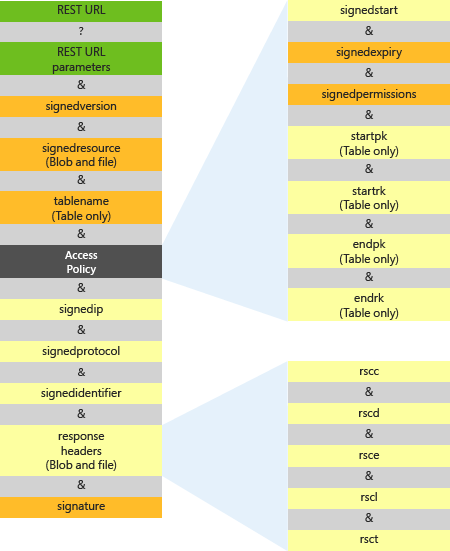

# Constructing a Service SAS
Beginning with version 2015-04-05, Azure Storage supports two types of shared access signatures (SAS):  
  
-   A service-level SAS, described in this topic. The service SAS delegates access to a resource in just one of the storage services: the Blob, Queue, Table, or File service.  
  
-   An account-level SAS, introduced with version 2015-04-05. The account SAS delegates access to resources in one or more of the storage services. All of the operations available via a service SAS are also available via an account SAS. Additionally, with the account SAS, you can delegate access to operations that apply to a given service, such as `Get/Set Service Properties` and `Get Service Stats`. You can also delegate access to read, write, and delete operations on blob containers, tables, queues, and file shares that are not permitted with a service SAS. See [Constructing an Account SAS](../StorageServicesREST/Constructing-an-Account-SAS.md) for more information about account SAS.  
  
 The URI for a service-level shared access signature (SAS)  consists of the URI to the resource for which the SAS will delegate access, followed by the SAS token. The SAS token is the query string that includes all of the information required to authenticate the SAS, as well as specifying the resource, the permissions available for access, the time interval over which the signature is valid, the supported IP address or address range from which requests can originate, the supported protocol with which a request can be made, an optional access policy identifier associated with the request, and the signature itself.  
  
 The following figure represents the parts of the shared access signature URI. Required parts appear in orange. The parts of the URI are described in the subsequent sections.  
  
   
  
## Specifying the Signed Version Field  
 The `signedversion` field contains the service version of the shared access signature. This value specifies the version of shared access authentication used by this shared access signature (in the `signature` field), and also specifies the service version of requests made with this shared access signature. See [Versioning for the Azure Storage Services](../StorageServicesREST/Versioning-for-the-Azure-Storage-Services.md) and [Azure Storage Services Versions 2015-07-08 and Earlier](../StorageServicesREST/Azure-Storage-Services-Versions-2015-07-08-and-Earlier.md) for information on which version is used when to execute requests via a shared access signature. See [Delegating Access with a Shared Access Signature](../StorageServicesREST/Delegating-Access-with-a-Shared-Access-Signature.md) for details about how this parameter affects authentication of requests made with a shared access signature.  
  
|Field name|Query parameter|Description|  
|----------------|---------------------|-----------------|  
|`signedversion`|`sv`|Required and only allowed in versions 2012-02-12 and newer. The storage service version to use to authenticate requests made with this shared access signature, and the service version to use when handling requests made with this shared access signature. See [Versioning for the Azure Storage Services](../StorageServicesREST/Versioning-for-the-Azure-Storage-Services.md) and [Azure Storage Services Versions 2015-07-08 and Earlier](../StorageServicesREST/Azure-Storage-Services-Versions-2015-07-08-and-Earlier.md) for information on which version is used when to execute requests via a shared access signature, and how clients executing the request can control the version using the `api-version` query parameter or the `x-ms-version` header.|  
  
### Determining the Version of a Legacy Shared Access Signature Request  
 In legacy scenarios where `signedversion` is not used, the Blob service applies rules to determine the version. See [Versioning for the Azure Storage Services](../StorageServicesREST/Versioning-for-the-Azure-Storage-Services.md) for more information about these rules.  
  
> [!IMPORTANT]
>  Client software might experience unexpected protocol behavior when using a shared access signature URI that uses a storage service version that is newer than the client software. Code that constructs shared access signature URIs should rely on versions that are understood by client software that makes storage service requests.  
  
## Specifying the Signed Resource (Blob Service Only)  
 The `signedresource` field specifies which resources are accessible via the shared access signature. The following table describes how to refer to a blob or container resource on the URI.  
  
|Field name|Query parameter|Description|  
|----------------|---------------------|-----------------|  
|`signedresource`|`sr`|Required.<br /><br /> Specify `b` if the shared resource is a blob. This grants access to the content and metadata of the blob.<br /><br /> Specify `c` if the shared resource is a container. This grants access to the content and metadata of any blob in the container, and to the list of blobs in the container.|  
  
## Specifying the Signed Resource (File Service Only)  
 SAS is supported for the File service in version 2015-02-21 and later.  
  
 The `signedresource` field specifies which resources are accessible via the shared access signature. The following table describes how to refer to a file or share resource on the URI.  
  
|Field name|Query Parameter|Description|  
|----------------|---------------------|-----------------|  
|`signedresource`|`sr`|Required.<br /><br /> Specify `f` if the shared resource is a file. This grants access to the content and metadata of the file.<br /><br /> Specify `s` if the shared resource is a share. This grants access to the content and metadata of any file in the share, and to the list of directories and files in the share.|  
  
## Specifying Query Parameters to Override Response Headers (Blob Service and File Service Only)  
 To define values for certain response headers to be returned when the shared access signature is used in a request, you can specify response headers in query parameters. This feature is supported beginning with version 2013-08-15 for the Blob service and version 2015-02-21 for the File service. Shared access signatures using this feature must include the `sv` parameter set to `2013-08-15` or later for the Blob service, or to `2015-02-21` or later for the File service.  
  
 The response headers and corresponding query parameters are as follows:  
  
|Response header name|Corresponding SAS query parameter|  
|--------------------------|---------------------------------------|  
|`Cache-Control`|`rscc`|  
|`Content-Disposition`|`rscd`|  
|`Content-Encoding`|`rsce`|  
|`Content-Language`|`rscl`|  
|`Content-Type`|`rsct`|  
  
 For example, if you specify the `rsct=binary` query parameter on a shared access signature created with version 2013-08-15 or later, the `Content-Type` response header is set to `binary`. This value overrides the `Content-Type` header value stored for the blob for a request using this shared access signature only.  
  
 Note that if you create a shared access signature that specifies response headers as query parameters, you must include those in the string-to-sign that is used to construct the signature string. See the **Constructing the Signature String** section below for details, and [Service SAS Examples](../StorageServicesREST/Service-SAS-Examples.md) for additional examples.  
  
## Specifying the Table Name (Table Service Only)  
 The `tablename` field specifies the name of the table to share.  
  
|Field name|Query parameter|Description|  
|----------------|---------------------|-----------------|  
|`tablename`|`tn`|Required. The name of the table to share.|  
  
## Specifying the Access Policy  
 The access policy portion of the URI indicates the period of time over which the shared access signature is valid and the permissions to be granted to the user. The parts of the URI described in the following table comprise the access policy.  
  
|Field name|Query parameter|Description|  
|----------------|---------------------|-----------------|  
|`signedstart`|`st`|Optional. The time at which the shared access signature becomes valid, in a UTC format compatible with ISO 8601. If omitted, start time for this call is assumed to be the time when the storage service receives the request.<br /><br /> In versions before 2012-02-12, the duration between `signedstart` and `signedexpiry` cannot exceed one hour unless a container policy is used.|  
|`signedexpiry`|`se`|Required. The time at which the shared access signature becomes invalid, in a UTC format compatible with ISO 8601. This field must be omitted if it has been specified in an associated stored access policy. For details, see Lifetime and Revocation of a shared access signature.|  
|`signedpermissions`|`sp`|Required. The permissions associated with the shared access signature. The user is restricted to operations allowed by the permissions. This field must be omitted if it has been specified in an associated stored access policy.|  
|`startpk`<br /><br /> `startrk`|`spk`<br /><br /> `srk`|Table service only.<br /><br /> Optional, but `startpk` must accompany `startrk`. The minimum partition and row keys accessible with this shared access signature. Key values are inclusive. If omitted, there is no lower bound on the table entities that can be accessed.|  
|`endpk`<br /><br /> `endrk`|`epk`<br /><br /> `erk`|Table service only.<br /><br /> Optional, but `endpk` must accompany `endrk`. The maximum partition and row keys accessible with this shared access signature. Key values are inclusive. If omitted, there is no upper bound on the table entities that can be accessed.|  
  
 The `signedpermissions` field is required on the URI unless it is specified as part of a stored access policy. The `startpk`, `startrk`, `endpk`, and `endrk` fields can only be specified on a table resource.  
  
## Specifying the Signature Validity Interval  
 The `signedstart` and `signedexpiry` fields must be expressed as UTC times and must adhere to a valid UTC format that is compatible ISO 8601 format. Supported ISO 8601 formats include the following:  
  
-   `YYYY-MM-DD`  
  
-   `YYYY-MM-DDThh:mmTZD`  
  
-   `YYYY-MM-DDThh:mm:ssTZD`  
  
> [!NOTE]
>  All values for `signedstart` and `signedexpiry` must be in UTC time.  
  
 For the date portion of these formats, `YYYY` is a four-digit year representation, `MM` is a two-digit month representation, and `DD` is a two-digit day representation. For the time portion, `hh` is the hour representation in 24-hour notation, `mm` is the two-digit minute representation, and `ss` is the two-digit second representation. A time designator `T` separates the date and time portions of the string, while a time zone designator `TZD` specifies a time zone (UTC).  
  
## Specifying Permissions  
 The permissions specified on the shared access signature URI indicate which operations are permitted on the shared resource. The following tables show the permissions supported by each resource type.  
  
 **Permissions for a blob**  
  
|Permission|URI symbol|Allowed operations|  
|----------------|----------------|------------------------|  
|Read|r|Read the content, properties, metadata and block list. Use the blob as the source of a copy operation.|  
|Add|a|Add a block to an append blob.|  
|Create|c|Write a new blob, snapshot a blob, or copy a blob to a new blob.|  
|Write|w|Create or write content, properties, metadata, or block list. Snapshot or lease the blob. Resize the blob (page blob only). Use the blob as the destination of a copy operation.|  
|Delete|d|Delete the blob.|  
  
 **Permissions for a container**  
  
|Permission|URI symbol|Allowed operations|  
|----------------|----------------|------------------------|  
|Read|r|Read the content, properties, metadata or block list of any blob in the container. Use any blob in the container as the source of a copy operation.|  
|Add|a|Add a block to any append blob in the container.|  
|Create|c|Write a new blob to the container, snapshot any blob in the container, or copy a blob to a new blob in the container.|  
|Write|w|For any blob in the container, create or write content, properties, metadata, or block list. Snapshot or lease the blob. Resize the blob (page blob only). Use the blob as the destination of a copy operation. **Note:**  You cannot grant permissions to read or write container properties or metadata, nor to lease a container, with a service SAS. Use an account SAS instead.|  
|Delete|d|Delete any blob in the container. **Note:**  You cannot grant permissions to delete a container with a service SAS. Use an account SAS instead.|  
|List|l|List blobs in the container.|  
  
 **Permissions for a file**  
  
|Permission|URI symbol|Allowed operations|  
|----------------|----------------|------------------------|  
|Read|r|Read the content, properties, metadata. Use the file as the source of a copy operation.|  
|Create|c|Create a new file or copy a file to a new file.|  
|Write|w|Create or write content, properties, metadata. Resize the file. Use the file as the destination of a copy operation.|  
|Delete|d|Delete the file.|  
  
 **Permission for a share**  
  
|Permission|URI symbol|Allowed operations|  
|----------------|----------------|------------------------|  
|Read|r|Read the content, properties or metadata of any file in the share. Use any file in the share as the source of a copy operation.|  
|Create|c|Create a new file in the share, or copy a file to a new file  in the share.|  
|Write|w|For any file in the share, create or write content, properties or metadata. Resize the file. Use the file as the destination of a copy operation. **Note:**  You cannot grant permissions to read or write share properties or metadata with a service SAS. Use an account SAS instead.|  
|Delete|d|Delete any file in the share. **Note:**  You cannot grant permissions to delete a share with a service SAS. Use an account SAS instead.|  
|List|l|List files and directories in the share.|  
  
 **Permissions for a queue**  
  
|Permission|URI symbol|Allowed operations|  
|----------------|----------------|------------------------|  
|Read|r|Read metadata and properties, including message count. Peek at messages.|  
|Add|a|Add messages to the queue.|  
|Update|u|Update messages in the queue. **Note:**  Use the Process permission with Update so you can first get the message you want to update.|  
|Process|p|Get and delete messages from the queue.|  
  
 **Permissions for a table**  
  
|Permission|URI symbol|Allowed operations|  
|----------------|----------------|------------------------|  
|Query|r|Get entities and query entities.|  
|Add|a|Add entities. **Note:**  Add and Update permissions are required for upsert operations.|  
|Update|u|Update entities. **Note:**  Add and Update permissions are required for upsert operations.|  
|Delete|d|Delete entities.|  
  
 Specify permissions by combining URI symbols in the `signedpermissions` field of your SAS URI. Permissions can be grouped to allow multiple operations to be performed with the given signature. You must include permissions in the order that they appear in the table for the resource type. For example, to grant all permissions to a container, the URI must specify `sp=rwdl`. To grant only read/write permissions, the URI must specify `sp=rw`.  
  
 Shared access signatures cannot grant access to some operations:  
  
-   Containers, queues, and tables cannot be created, deleted, or listed.  
  
-   Container metadata and properties cannot be read or written.  
  
-   Queues cannot be cleared and their metadata may not be written.  
  
-   Containers cannot be leased.  
  
> [!IMPORTANT]
>  Shared access signature URIs are keys that grant permissions to storage resources, and should be protected in the same manner as a shared key. Operations that use shared access signature URIs should only be performed over an HTTPS connection, and shared access signature URIs should only be distributed on a secure connection such as HTTPS.  
  
## Specifying IP Address or IP Range  
 Beginning with version 2015-04-05, the optional signed IP (`sip`) field specifies an IP address or a range of IP addresses from which to accept requests. If the IP address from which the request originates does not match the IP address or address range specified on the SAS token, the request is not authenticated.  
  
 When specifying a range of IP addresses, note that the range is inclusive.  
  
 For example, specifying `sip=168.1.5.65` or `sip=168.1.5.60-168.1.5.70` on the SAS restricts the request to those IP addresses.  
  
## Specifying the HTTP Protocol  
 Beginning with version 2015-04-05, the optional signed protocol (`spr`) field specifies the protocol permitted for a request made with the SAS. Possible values are both HTTPS and HTTP (`https,http`) or HTTPS only (`https`).  The default value is `https,http`.  Note that HTTP only is not a permitted value.  
  
## Specifying Table Access Ranges  
 The `startpk`, `startrk`, `endpk`, and `endrk` fields define a range of table entities associated with a shared access signature. Table queries will only return results that are within the range, and attempts to use the shared access signature to add, update, or delete entities outside this range will fail. If `startpk` equals `endpk`, the shared access signature only authorizes access to entities in one partition in the table. If `startpk` equals `endpk` and `startrk` equals `endrk`, the shared access signature can only access one entity  in one partition. Use the following table to understand how these fields constrain access to entities in a table.  
  
|Fields present|Scope of constraint|  
|--------------------|-------------------------|  
|`startpk`|partitionKey >= `startpk`|  
|`endpk`|partitionKey <= `endpk`|  
|`startpk`, `startrk`|(partitionKey > `startpk`) &#124;&#124; (partitionKey == `startpk` && rowKey >= `startrk`)|  
|`endpk`, `endrk`|(partitionKey < `endpk`) &#124;&#124; (partitionKey == `endpk` && rowKey <= `endrk`)|  
  
## Specifying the Signed Identifier  
 Specifying the `signedidentifier` field on the URI relates the given shared access signature to a corresponding stored access policy. A stored access policy provides an additional measure of control over one or more shared access signatures, including the ability to revoke the signature if needed. Each container, queue, table, or share can have up to 5 stored access policies.  
  
 The following table describes how to refer to a signed identifier on the URI.  
  
|Field name|Query parameter|Description|  
|----------------|---------------------|-----------------|  
|`signedidentifier`|`si`|Optional. A unique value up to 64 characters in length that correlates to an access policy specified for the container, queue, or table.|  
  
 A stored access policy includes a signed identifier, a value up to 64 characters long that is unique within the resource. The value of this signed identifier can be specified for the `signedidentifier` field in the URI for the shared access signature. Specifying a signed identifier on the URI associates the signature with the stored access policy. To establish a container-level access policy using the REST API, see [Delegating Access with a Shared Access Signature](../StorageServicesREST/Delegating-Access-with-a-Shared-Access-Signature.md).  
  
###  <a name="bk_LifetimeAndRevocation"></a> Lifetime and Revocation of a Shared Access Signature  
 Shared access signatures grant users access rights to storage account resources. When planning to use a shared access signature, think about the lifetime of the signature and whether your application may need to revoke access rights under certain circumstances.  
  
 One way that you can manage a shared access signature is to control its lifetime by setting the `signedexpiry` field of the access policy. If you want to continue to grant a client access to the resource after the expiry time, you must issue a new signature. It’s recommended that you keep the lifetime of a shared access signature short. Before version 2012-02-12, a shared access signature not associated with a stored access policy could not have an active period that exceeded one hour.  
  
 Another way to manage a shared access signature is to associate the signature with a stored access policy. The stored access policy is represented by the `signedidentifier` field on the URI. A stored access policy provides an additional measure of control over one or more shared access signatures, including the ability to revoke the signature if needed.  
  
 To revoke a shared access signature that is tied to a stored access policy, you can remove the stored access policy. If the storage service cannot locate the stored access policy specified in the shared access signature, the client will not be able to access the resource indicated by the URI.  
  
 To revoke a Shared Access signature that is not tied to a stored access policy, you must change the shared key on the storage account that was used to create the signature.  
  
 Best practices recommend that a shared access signature be used together with a signed identifier that references a stored access policy, or, if no signed identifier is specified, that the interval over which the signature is valid be kept short. For more information on associating a signature with a stored access policy, see [Use a Stored Access Policy](assetId:///c0d4fe58-e6f4-4a90-bad5-138f59967560).  
  
> [!NOTE]
>  The access policy for a shared access signature consists of the start time, expiry time, and permissions for the signature. You can specify all of these parameters on the signature URI and none within the stored access policy; all on the container and none on the URI; or some combination of the two. However, you cannot specify a given parameter on both the signature URI and the stored access policy. See [Controlling a SAS with a stored access policy](https://azure.microsoft.com/documentation/articles/storage-dotnet-shared-access-signature-part-1/) for more information.  
  
## Specifying the Signature  
 The signature part of the URI is used to authenticate the request made with the shared access signature. The Blob service uses a Shared Key authentication scheme to authenticate the shared access signature. The following table describes how to specify the signature on the URI.  
  
|Field name|Query parameter|Description|  
|----------------|---------------------|-----------------|  
|`signature`|`sig`|The string-to-sign is a unique string constructed from the fields that must be verified in order to authenticate the request. The signature is an HMAC computed over the string-to-sign and key using the SHA256 algorithm, and then encoded using Base64 encoding.|  
  
### Constructing the Signature String  
 To construct the signature string of a shared access signature, first construct the string-to-sign from the fields comprising the request, then encode the string as UTF-8 and compute the signature using the HMAC-SHA256 algorithm. Note that fields included in the string-to-sign must be URL-decoded.  
  
 **Version 2015-04-05 and later**  
  
 Version 2015-04-05 adds support for the signed IP  and signed protocol fields. These must be included in the string-to-sign. To construct the string-to-sign for Blob or File service resources, use the following format:  
  
```  
  
StringToSign = signedpermissions + "\n" +  
               signedstart + "\n" +  
               signedexpiry + "\n" +  
               canonicalizedresource + "\n" +  
               signedidentifier + "\n" +  
               signedIP + "\n" +  
               signedProtocol + "\n" +  
               signedversion + "\n" +  
               rscc + "\n" +  
               rscd + "\n" +  
               rsce + "\n" +  
               rscl + "\n" +  
               rsct  
```  
  
 To construct the string-to-sign for Table service resources, use the following format:  
  
```  
  
StringToSign = signedpermissions + "\n" +  
               signedstart + "\n" +  
               signedexpiry + "\n" +  
               canonicalizedresource + "\n" +  
               signedidentifier + "\n" +  
               signedIP + "\n" +  
               signedProtocol + "\n" +  
               signedversion + "\n" +  
               startingPartitionKey + "\n"  
               startingRowKey + "\n"  
               endingPartitionKey + "\n"  
               endingRowKey  
  
```  
  
 To construct the string-to-sign for Queue service resources, use the following format:  
  
```  
  
StringToSign = signedpermissions + "\n" +  
               signedstart + "\n" +  
               signedexpiry + "\n" +  
               canonicalizedresource + "\n" +  
               signedidentifier + "\n" +  
               signedIP + "\n" +  
               signedProtocol + "\n" +  
               signedversion  
  
```  
  
 **Version 2013-08-15 through version 2015-02-21**  
  
 To construct the string-to-sign for Blob or File service resources using the 2013-08-15 version through version 2015-02-21, use the following format. Note that for the File service, SAS is supported beginning with version 2015-02-21.  
  
```  
  
StringToSign = signedpermissions + "\n" +  
               signedstart + "\n" +  
               signedexpiry + "\n" +  
               canonicalizedresource + "\n" +  
               signedidentifier + "\n" +  
               signedversion + "\n" +  
               rscc + "\n" +  
               rscd + "\n" +  
               rsce + "\n" +  
               rscl + "\n" +  
               rsct  
```  
  
 To construct the string-to-sign for a table, use the following format:  
  
```  
  
StringToSign = signedpermissions + "\n" +  
               signedstart + "\n" +  
               signedexpiry + "\n" +  
               canonicalizedresource + "\n" +  
               signedidentifier + "\n" +  
               signedversion + "\n" +  
               startpk + "\n" +  
               startrk + "\n" +  
               endpk + "\n" +  
               endrk  
  
```  
  
 To construct the string-to-sign for a queue, use the following format:  
  
```  
StringToSign = signedpermissions + "\n" +  
               signedstart + "\n" +  
               signedexpiry + "\n" +  
               canonicalizedresource + "\n" +  
               signedidentifier + "\n" +  
               signedversion  
  
```  
  
 **Version 2012-02-12**  
  
 To construct the string-to-sign for Blob service resources for version 2012-02-12, use the following format:  
  
```  
  
StringToSign = signedpermissions + "\n" +  
               signedstart + "\n" +  
               signedexpiry + "\n" +  
               canonicalizedresource + "\n" +  
               signedidentifier + "\n" +  
               signedversion  
```  
  
 **Versions Prior to 2012-02-12**  
  
 To construct the string-to-sign for Blob service resources for versions prior to 2012-02-12, use the following format:  
  
```  
  
StringToSign = signedpermissions + "\n" +  
               signedstart + "\n" +  
               signedexpiry + "\n" +  
               canonicalizedresource + "\n" +  
               signedidentifier  
  
```  
  
 When constructing the string to be signed, keep in mind the following:  
  
-   If a field is optional and not provided as part of the request, specify an empty string for that field. Be sure to include the newline character (\n) after the empty string.  
  
-   String-to-sign for a table must include the additional parameters, even if they are empty strings.  
  
-   The `signedpermission` portion of the string must include the permission designations in a fixed order that is specific to each resource type. Any combination of these permissions is acceptable, but the order of permission letters must match the order in the following table.  
  
    |Resource type|Ordering of permissions|  
    |-------------------|-----------------------------|  
    |Blob or File|rwd|  
    |Container or Share|rwdl|  
    |Queue|raup|  
    |Table|raud|  
  
     For example, valid permissions settings for a container or share include `rw`, `rd`, `rl`, `wd`, `wl`, and `rl`. Invalid settings include `wr`, `dr`, `lr`, and `dw`. Specifying a permission designation more than once is not permitted.  
  
-   The `canonicalizedresouce` portion of the string is a canonical path to the signed resource. It must include the service name (blob, table, queue or file) for version 2015-02-21 or later, the storage account name, and the resource name, and must be URL-decoded. Names of blobs must include the blob’s container. Table names must be lower-case. The following examples show how to construct the `canonicalizedresource` portion of the string, depending on the type of resource.  
  
     **Containers**  
  
     For version 2015-02-21 and later:  
  
    ```  
    URL = https://myaccount.blob.core.windows.net/music  
    canonicalizedresource = "/blob/myaccount/music"  
    ```  
  
     For versions prior to 2015-02-21:  
  
    ```  
    URL = https://myaccount.blob.core.windows.net/music   
    canonicalizedresource = "/myaccount/music"  
    ```  
  
     **Blobs**  
  
     For version 2015-02-21 and later:  
  
    ```  
    URL = https://myaccount.blob.core.windows.net/music/intro.mp3  
    canonicalizedresource = "/blob/myaccount/music/intro.mp3"  
  
    ```  
  
     For versions prior to 2015-02-21:  
  
    ```  
    URL = https://myaccount.blob.core.windows.net/music/intro.mp3   
    canonicalizedresource = "/myaccount/music/intro.mp3"  
    ```  
  
     **File Shares**  
  
    ```  
    URL = https://myaccount.file.core.windows.net/music   
    canonicalizedresource = "/file/myaccount/music"  
    ```  
  
     **Files**  
  
    ```  
    URL = https://myaccount.file.core.windows.net/music/intro.mp3   
    canonicalizedresource = "/file/myaccount/music/intro.mp3"  
    ```  
  
     **Queues**  
  
     For version 2015-02-21 and later:  
  
    ```  
    URL = https://myaccount.queue.core.windows.net/thumbnails  
    canonicalizedresource = "/queue/myaccount/thumbnails"  
  
    ```  
  
     For versions prior to 2015-02-21:  
  
    ```  
    URL = https://myaccount.queue.core.windows.net/thumbnails  
    canonicalizedresource = "/myaccount/thumbnails"  
  
    ```  
  
     **Tables**  
  
     If the signed resource is a table, assure the table name is lower-case in the canonicalized format.  
  
     For version 2015-02-21 and later:  
  
    ```  
    URL = https://myaccount.table.core.windows.net/Employees(PartitionKey='Jeff',RowKey='Price')  
    canonicalizedresource = "/table/myaccount/employees"  
  
    ```  
  
     For versions prior to 2015-02-21:  
  
    ```  
    URL = https://myaccount.table.core.windows.net/Employees(PartitionKey='Jeff',RowKey='Price')  
    canonicalizedresource = "/myaccount/employees"  
  
    ```  
  
-   Provide a value for the `signedidentifier` portion of the string if you are associating the request with a stored access policy.  
  
-   A shared access signature that specifies a storage service version before 2012-02-12 can only share a blob or container, and must omit `signedversion` and the newline before it.  
  
## See Also  
 [Delegating Access with a Shared Access Signature](../StorageServicesREST/Delegating-Access-with-a-Shared-Access-Signature.md)   
 [Constructing an Account SAS](../StorageServicesREST/Constructing-an-Account-SAS.md)   
 [SAS Error Codes](../StorageServicesREST/SAS-Error-Codes.md)